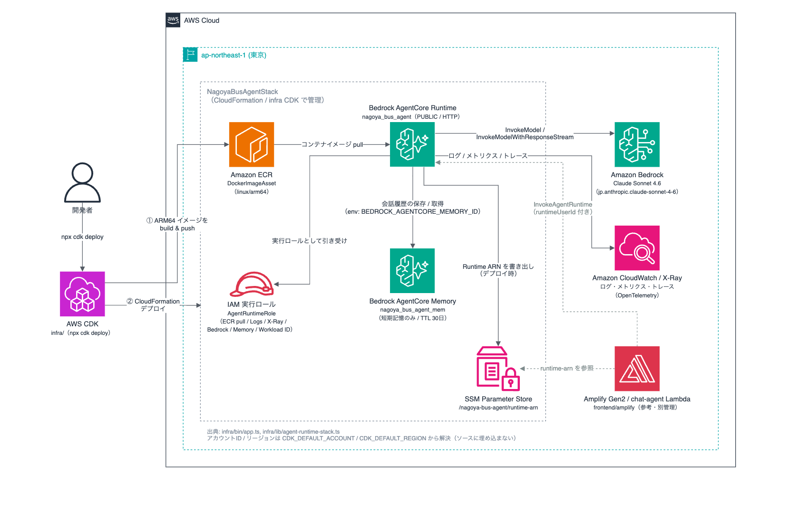
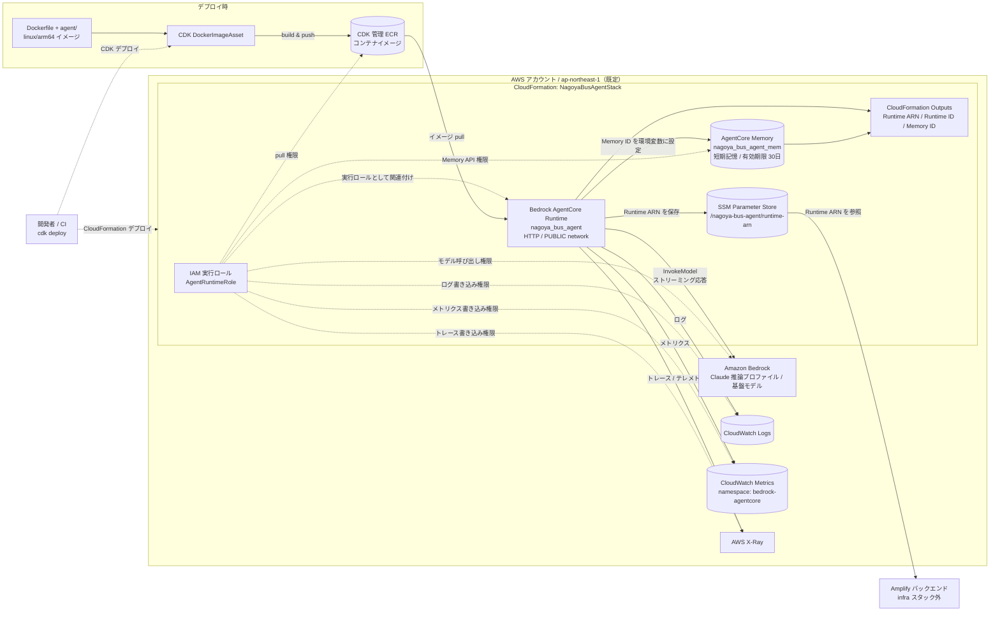

# Nagoya Bus Agent インフラ構成図

`infra/lib/agent-runtime-stack.ts` に定義された `NagoyaBusAgentStack` の構成を示します。

## システム構成図

編集可能なソースは [architecture.drawio](./architecture.drawio)（draw.io / diagrams.net で編集可能）。
図を更新した場合は draw.io から PNG をエクスポートして `architecture.png` を差し替えてください。

## リソース関係の詳細（Mermaid）

実線はリソース間の実行時の通信または値の受け渡し、破線はデプロイ時の処理や権限付与を表します。

## 構成上の要点

- CDK はリポジトリルートの `Dockerfile` から ARM64 イメージをビルドし、CDK が管理する ECR リポジトリへ push します。
- AgentCore Runtime は ECR のイメージを HTTP プロトコル、`PUBLIC` ネットワークモードで実行します。`PUBLIC` はネットワークモードの指定であり、無認証の公開 HTTP エンドポイントを意味しません。
- Memory ID は `BEDROCK_AGENTCORE_MEMORY_ID` 環境変数として Runtime に渡されます。Memory Strategy は未指定のため短期記憶のみで、イベントの有効期限は 30 日です。
- IAM 実行ロールには ECR pull、Bedrock モデル呼び出し、AgentCore Memory、CloudWatch Logs / Metrics、X-Ray、および AgentCore Workload Identity の権限が付与されます。
- Runtime ARN は SSM Parameter Store に保存され、スタック外の Amplify バックエンドとの連携点になります。
- AWS アカウントとリージョンはデプロイ環境から解決され、リージョン未指定時は `ap-northeast-1` が使われます。

## 定義リソース対応表

| CDK 論理 ID | AWS リソース | 用途 |
|---|---|---|
| `AgentImage` | ECR Docker image asset | AgentCore Runtime が実行するコンテナイメージ |
| `AgentMemory` | Bedrock AgentCore Memory | セッションの短期記憶 |
| `AgentRuntimeRole` | IAM Role | Runtime の AWS サービスアクセス権限 |
| `AgentRuntime` | Bedrock AgentCore Runtime | Python エージェントコンテナの実行環境 |
| `RuntimeArnParameter` | SSM StringParameter | Amplify へ Runtime ARN を受け渡す連携点 |

